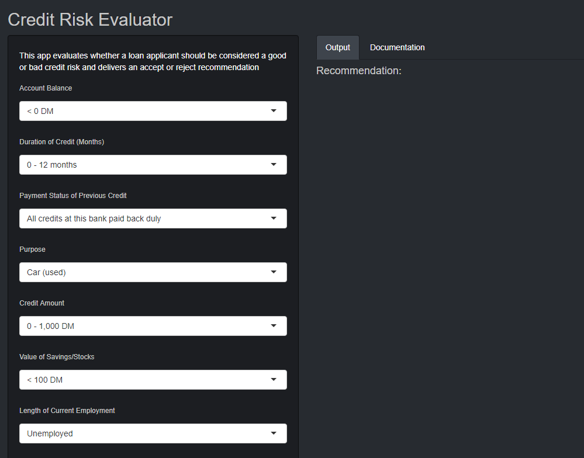
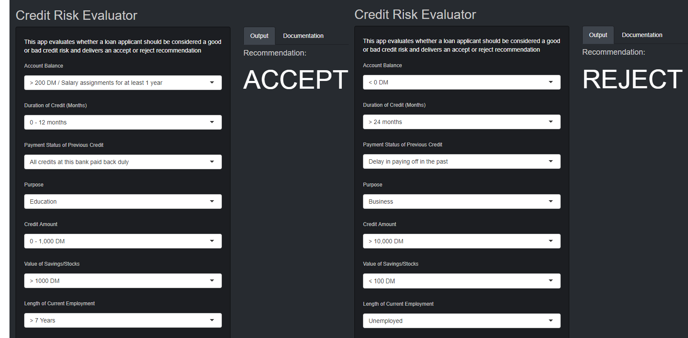

```{r setup, include=FALSE}
knitr::opts_chunk$set(echo = TRUE)
```

## Introduction

This project will first look to extract insights from data in order to present to others. It will then build on this to create a customer-facing system that can be run multiple times with different pieces of data to generate different outputs. It will do this by applying a machine learning model to an original set of data and then creating a user-friendly application in order to input new data into the model. The following steps will be used to achieve the above:

- Import and clean a data set
- Create predictions using training and test data and relevant machine learning models
- Use the model to design a customer-facing application

### The project

Credit risk is the risk of a borrow defaulting on a debt and that the lender may lose the principal of the loan or associated interest. When a bank receives a loan application, it has to make a decision as to whether to approve the loan or not based on the applicant's profile. If the bank deems the applicant to have bad credit risk, it means the applicant is not likely to repay the loan and approving the loan could result in financial loss to the bank.

The purpose of this project is to take a data set of loan applications and build a predictive model for making a decision as to whether to approve a loan based on the applicant's profile. An application will then be built which is intended to provide guidance to a bank manager for making this decision.

### The data

The data for the analysis is a set of 1000 German credit applications with 20 different attributes of the applicant. The original data is from the UCI Machine Learning Repository but the CSV version used in this analysis can be found from the Penn State University website (https://onlinecourses.science.psu.edu/stat857/node/215). Further information about the data set can be found at:

https://archive.ics.uci.edu/ml/datasets/statlog+(german+credit+data)

*Note: the data is taken from 1994 and therefore all monetary amounts are valued in Deutsche Mark (DM).*


## Gathering and cleaning the data

As always, the first step of analysis is to read the data into RStudio and perform cleaning of the data to prepare for exploratory analysis.

```{r warning=FALSE, message=FALSE}
library(ggplot2)
library(cowplot)
library(caret)
library(ROCR)
library(rpart)
library(rpart.plot)
library(rattle)
library(randomForest)
```

The data set used will be the numeric data which is more suitable for some algorithms that cannot cope with categorical variables.

```{r}
credit <- read.csv('data/german_credit.csv', header = TRUE)
str(credit)
```

More information about the attribute information and what the numeric values mean can be found at the UCI link above. One thing to note immediately is that three of the columns contain continuous variables rather than categorical data (duration of credit, credit amount and age). This is potentially important information in deciding credit risk and therefore one solution is to transform the data into categorical variables using the cut function.

```{r}
credit$Duration.of.Credit..month. <- cut(credit$Duration.of.Credit..month., c(0,12,18,24,Inf), labels = c(1:4))
credit$Credit.Amount <- cut(credit$Credit.Amount, c(0,1000,5000,10000,Inf), labels = c(1:4))
credit$Age..years. <- cut(credit$Age..years., c(18,25,40,60,Inf), labels = c(1:4))
head(credit[,c(3,6,14)],5)
```

The new structure of the three columns can be seen above. The categories have changed as follows. Duration of Credit (month):

1. 0 - 12 months
2. 13 - 18 months
3. 19 - 24 months
4. Over 24 months

Credit Amount:

1. 0 - 1,000 DM
2. 1,001 - 5,000 DM
3. 5,001 - 10,000 DM
4. Over 10,000 DM

Age:

1. 18 - 25
2. 26 - 40
3. 41 - 60
4. Over 60

Finally, the remaining columns can be converted to factors.

```{r}
for(i in 1:21) credit[, i] <- as.factor(credit[, i])
```

## Exploratory analysis

Before starting the modeling phase, it is important to explore the data to get an idea of any patterns or areas of interest.

The first thing is to examine how many examples of good and bad credit risk there are.

```{r}
g <- ggplot(credit, aes(Creditability)) +
        geom_bar(fill = "#4EB25A") +
        theme(axis.title.x=element_blank()) + 
        theme(axis.title.y=element_blank()) +
        scale_y_continuous(breaks=seq(0,700,100)) +
        scale_x_discrete(labels = c("Bad","Good")) +
        ggtitle("Count of Good and Bad Credit Risks")
g
```

The plot shows 300 examples of bad credit risk applicants versus 700 good. This is something that should be noted later when splitting the data set into training and test sets.

The next step is to explore some of the variables in the data. For example, it might be a fair assumption that amount of total savings is strongly linked to the credit risk of the applicant i.e. an applicant with little money in their account is a higher credit risk than one with a lot of savings? Another plot can be produced to confirm this.

```{r}
g <- ggplot(credit, aes(Value.Savings.Stocks, fill = Creditability), stat="identity") +
        geom_bar() +
        scale_fill_manual(values = c("#D3D6D4", "#4EB25A"), labels=c("Bad","Good")) +
        theme(axis.title.x=element_blank()) +
        theme(axis.title.y=element_blank()) +
        scale_y_continuous(breaks=seq(0,700,100)) +
        scale_x_discrete(labels = c("< 100 DM", "100-500 DM", "500-1000 DM", "> 1000 DM", "Unknown")) +
        theme(axis.text.x = element_text(angle = 45, hjust = 1, size = 10)) + 
        theme(axis.text.y = element_text(size = 10)) +
        theme(legend.text=element_text(size=10)) +
        theme(legend.title=element_text(size=12)) +
        ggtitle("Good and Bad Credit Risks by Credit History")
g
```

The plot seems to back up the rationale. A higher percentage of applicants with less savings are deemed as having bad credit risk.

Another area to explore is how credit risk relates to employment status. There are four statuses for employment in the data:

1. Unemployed/ Unskilled (non-resident)
2. Unskilled (resident)
3. Skilled employee / Official
4. Management / Self-employed / Highly Qualified Employee / Officer

```{r}
g <- ggplot(credit, aes(Occupation, fill = Creditability), stat="identity") +
        geom_bar() +
        scale_fill_manual(values = c("#D3D6D4", "#4EB25A"), labels=c("Bad","Good")) +
        theme(axis.title.x=element_blank()) +
        theme(axis.title.y=element_blank()) +
        scale_y_continuous(breaks=seq(0,700,100)) +
        scale_x_discrete(labels = c("Unemployed", "Unskilled", "Skilled", "Management")) +
        theme(axis.text.x = element_text(angle = 45, hjust = 1, size = 10)) + 
        theme(axis.text.y = element_text(size = 10)) +
        theme(legend.text=element_text(size=10)) +
        theme(legend.title=element_text(size=12)) +
        ggtitle("Good and Bad Credit Risks by Occupation")
g
```

There appears to be less of a link with occupation. Most of the applicants come under 'skilled employee' but the credit ability of unskilled employees and management/highly qualified employees does not appear significantly different. However further statistical modeling is needed to support this initial analysis.

Finally, some exploration can be performed on one of the new categorical variables created above. This example will look at age.

```{r}
g <- ggplot(credit, aes(Age..years., fill = Creditability), stat="identity") +
        geom_bar() +
        scale_fill_manual(values = c("#D3D6D4", "#4EB25A"), labels=c("Bad","Good")) +
        theme(axis.title.x=element_blank()) +
        theme(axis.title.y=element_blank()) +
        scale_y_continuous(breaks=seq(0,700,100)) +
        scale_x_discrete(labels = c("18-25", "26-40", "41-60", "60+")) +
        theme(axis.text.x = element_text(angle = 45, hjust = 1, size = 10)) + 
        theme(axis.text.y = element_text(size = 10)) +
        theme(legend.text=element_text(size=10)) +
        theme(legend.title=element_text(size=12)) +
        ggtitle("Good and Bad Credit Risks by Age")
g
```

This analysis indicates perhaps some decrease in credit risk with age. However there is probably a lot of correlation between age and other factors such as savings and property so further statistical analysis is needed.

## Statistical modeling

### Logistic regression

The first step before applying models is to create training and test data sets. The data will be split 70/30 and spread evenly between good and bad credit risks using the *CreateDataPartition* function in the *caret* package.

```{r}
set.seed(2828)
inTraining <- createDataPartition(credit$Creditability, p=0.7, list=FALSE)
train <- credit[inTraining,]
test <- credit[-inTraining,]
```

The first model is logistic regression using the *glm()* function.

```{r}
set.seed(2828)
lmModel <- glm(Creditability ~ ., family = binomial, data = train)

# Fit model to test set
lmFit <- predict(lmModel, type = "response", test)

# Compare predictions to test set
lmPred <- prediction(lmFit, test$Creditability)

# Create Area Under the Curve (AUC) plot
plot(performance(lmPred, 'tpr', 'fpr'))
```

```{r}
performance(lmPred, measure = 'auc')@y.values[[1]]
```

The AUC of the model is 0.787. This is a measure of the model's performance by evaluating the trade off between the true positive and false positive rate i.e. how good is the model at identifying good credit risk without falsely identifying bad risks as good?

This is a fairly good score but the next sections will look at classification trees and random forests to try and improve on this.

### Decision Tree

Decision trees use a tree-like model of decisions and their outcomes to create a prediction model.

```{r}
set.seed(28)
dtModel <- rpart(Creditability ~ ., data=train)
fancyRpartPlot(dtModel)
```

As before, the model is fit to the test data to analyse the performance.

```{r}
dtFit <- predict(dtModel, test, type = 'prob')[, 2]
dtPred <- prediction(dtFit, test$Creditability)
plot(performance(dtPred, 'tpr', 'fpr'))
```

```{r}
performance(dtPred, measure = 'auc')@y.values[[1]]
```

This model has performed less well than logistic regression.

### Random Forest

The final model is Random Forest. Random forests operate by constructing a number of decision trees on the training data set and outputting the class that is the mode of the classes across the decision trees.

```{r}
set.seed(2828)
rfModel <- randomForest(Creditability ~ ., data=train)
rfFit <- predict(rfModel, test, type = 'prob')[,2]
rfPred <- prediction(rfFit, test$Creditability)
plot(performance(rfPred, 'tpr', 'fpr'))
```

```{r}
performance(rfPred, measure = 'auc')@y.values[[1]]
```

The Random Forest model returns an AUC of 0.795 which is slightly better than the logistic regression model. This is the model which will be used for the final application.

The plot below shows the rank of importance for variables in the Random Forest model. Account balance is ranked as the most significant measurement in the model with purpose second. Purpose identifies the reason for the applicant's request for credit e.g. car, education, business etc.

```{r fig.height=8, fig.width=8}
par(mfrow=c(1,1))
varImpPlot(rfModel, pch=1, main="Random Forest Model Variables Importance")
```

The confusion matrix below shows the split between prediction success of good (1) and bad (0) credit risks and an overall accuracy of 76.67%.

```{r}
rfCM <- confusionMatrix(test$Creditability,
                        predict(rfModel, test, type="class"))
rfCM
```

The next and final step is to build the application designed to aid bank managers.

### Final Application

The application will be built using the Shiny package in RStudio. Two separate scripts are created in order to produce the application. The UI.R script sets out the look and feel of the application while the server.R script has the underlying code to provide the functionality. The app will feature drop down boxes in the tool bar where the user can input the data and the accept/rejection decision will be shown in the middle of the page.

The UI.r script is shown below:

```{r eval=FALSE}
library(shiny)
library(shinythemes)

shinyUI(fluidPage(
        theme = shinytheme("slate"),
        titlePanel("Credit Risk Evaluator"),
        sidebarLayout(
                sidebarPanel(
                        helpText("This app evaluates whether a loan applicant should be considered a good or bad credit risk and delivers an accept or reject recommendation"),            
                        selectInput("account_balance",
                                    label = h6("Account Balance"),
                                    choices = list("< 0 DM" = 1,
                                                   "0 - 200 DM" = 2,
                                                   "> 200 DM / Salary assignments for at least 1 year" =3,
                                                   "No checking account" = 4),
                                    selected = 1 
                        ),
                        selectInput("duration_of_credit",
                                    label = h6("Duration of Credit (Months)"),
                                    choices = list("0 - 12 months" = 1,
                                                   "13 - 18 months" = 2,
                                                   "19 - 24 months" =3,
                                                   "> 24 months" = 4),
                                    selected = 1 
                        ),
                        selectInput("payment_status_previous_credit",
                                    label = h6("Payment Status of Previous Credit"),
                                    choices = list("No credits taken / All credits paid back duly" = 0,
                                                   "All credits at this bank paid back duly" = 1,
                                                   "Existing credits paid back duly till now" =2,
                                                   "Delay in paying off in the past" = 3,
                                                   "Critical account / Other credits existing (not at this bank)" = 4),
                                    selected = 1 
                        ),
                        selectInput("purpose",
                                    label = h6("Purpose"),
                                    choices = list("Car (new)" = 0,
                                                   "Car (used)" = 1,
                                                   "Furniture / Equipment" = 2,
                                                   "Radio / Television" = 3,
                                                   "Domestic Appliances" = 4,
                                                   "Repairs" = 5,
                                                   "Education" = 6,
                                                   "Re-training" = 7,
                                                   "Business" =8,
                                                   "Other" = 9),
                                    selected = 1 
                        ),
                        selectInput("credit_amount",
                                    label = h6("Credit Amount"),
                                    choices = list("0 - 1,000 DM" = 1,
                                                   "1,001 - 5,000 DM" = 2,
                                                   "5,001 - 10,000 DM" =3,
                                                   "> 10,000 DM" = 4),
                                    selected = 1 
                        ),
                        selectInput("value_savings",
                                    label = h6("Value of Savings/Stocks"),
                                    choices = list("< 100 DM" = 1,
                                                   "100 - 500 DM" = 2,
                                                   "500 - 1000 DM" = 3,
                                                   "> 1000 DM" =4,
                                                   "Unknown / No Savings Account" = 5),
                                    selected = 1 
                        ),
                        selectInput("length_employment",
                                    label = h6("Length of Current Employment"),
                                    choices = list("Unemployed" = 1,
                                                   "< 1 Year" = 2,
                                                   "1 - 4 Years" = 3,
                                                   "4 - 7 Years" =4,
                                                   "> 7 Years" = 5),
                                    selected = 1 
                        ),
                        selectInput("instalment_percent",
                                    label = h6("Instalment (%) of Disposable Income"),
                                    choices = list("1%" = 1,
                                                   "2%" = 2,
                                                   "3%" =3,
                                                   "4% and above" = 4),
                                    selected = 1 
                        ),
                        selectInput("sex_marital_status",
                                    label = h6("Sex and Marital Status"),
                                    choices = list("Male : Divorced / Separated" = 1,
                                                   "Female : Divorced / Separated / Married " = 2,
                                                   "Male : Single" = 3,
                                                   "Male : Married / Widowed" = 4,
                                                   "Female : Single" = 5),
                                    selected = 1
                        ),
                        selectInput("guarantors",
                                    label = h6("Guarantors"),
                                    choices = list("None" = 1,
                                                   "Co-applicant" = 2,
                                                   "Guarantor" = 3),
                                    selected = 1 
                        ),
                        selectInput("duration_current_address",
                                    label = h6("Time in Current Address"),
                                    choices = list("< 1 Year" = 1,
                                                   "1 - 2 Years" = 2,
                                                   "2 - 3 Years" =3,
                                                   "> 3 Years" = 4),
                                    selected = 1 
                        ),
                        selectInput("most_valuable_asset",
                                    label = h6("Most Valuable Available Asset"),
                                    choices = list("Real Estate" = 1,
                                                   "Building Society Savings Agreement / Life Insurance" = 2,
                                                   "Car or Other" =3,
                                                   "Unknown / No Property" = 4),
                                    selected = 1 
                        ),
                        selectInput("age",
                                    label = h6("Age"),
                                    choices = list("18 - 25" = 1,
                                                   "26 - 40" = 2,
                                                   "41 - 60" =3,
                                                   "Over 60" = 4),
                                    selected = 1 
                        ),
                        selectInput("concurrent_credits",
                                    label = h6("Concurrent Credits"),
                                    choices = list("Bank" = 1,
                                                   "Stores" =2,
                                                   "None" = 3),
                                    selected = 1 
                        ),
                        selectInput("type_apartment",
                                    label = h6("Type of Apartment"),
                                    choices = list("Rent" = 1,
                                                   "Own" = 3,
                                                   "For Free" = 4),
                                    selected = 1 
                        ),
                        selectInput("num_credits_this_bank",
                                    label = h6("Number of Credits at This Bank"),
                                    choices = list("1" = 1,
                                                   "2" = 2,
                                                   "3" =3,
                                                   "4 or more" = 4),
                                    selected = 1 
                        ),
                        selectInput("occupation",
                                    label = h6("Occupation"),
                                    choices = list("Unemployed / Unskilled - Non-resident " = 1,
                                                   "Unskilled - Resident " = 2,
                                                   "Skilled Employee / Official " =3,
                                                   "Management / Self-employed / 
Highly Qualified Employee / Officer " = 4),
                                    selected = 1 
                        ),
                        selectInput("num_dependents",
                                    label = h6("Number of Dependents"),
                                    choices = list("0 - 1" = 1,
                                                   "2 or more" = 2),
                                    selected = 1 
                        ),
                        selectInput("telephone",
                                    label = h6("Telephone"),
                                    choices = list("None" = 1,
                                                   "Yes, Registered Under the Customer's Name" = 4),
                                    selected = 1 
                        ),
                        selectInput("foreign_worker",
                                    label = h6("Foreign Worker"),
                                    choices = list("Yes" = 1,
                                                   "No" = 2),
                                    selected = 1 
                        ), 
                        br(),
                        actionButton("action_Calc", label = "Evaluate")        
                ),
                mainPanel(
                        tabsetPanel(
                                tabPanel("Output",
                                         p(h4("Recommendation:")),
                                         textOutput("decision"),
                                         tags$head(tags$style("#decision{color: white; font-size: 60px;}")
                                         )
                                ),
                                tabPanel("Documentation",
                                         p(h4("Credit Risk Evaluator:")),
                                         br(),
                                         helpText("This application evaluates whether or not a credit applicant has good or bad credit risk and delivers an accept or reject recommendation. The model was developed using a random forests model which was run on a data set of 1000 German credit applications."),
                                         HTML("")                
                                )
                        )
                )
        )
))
```

The server.R script:

```{r eval=FALSE}
library(shiny)
library(caret)
library(randomForest)

shinyServer(function(input, output) {
        
        credit <- read.csv('german_credit.csv', header = TRUE)
        credit$Duration.of.Credit..month. <- cut(credit$Duration.of.Credit..month., c(0,12,18,24,Inf), labels = c(1:4))
        credit$Credit.Amount <- cut(credit$Credit.Amount, c(0,1000,5000,10000,Inf), labels = c(1:4))
        credit$Age..years. <- cut(credit$Age..years., c(18,25,40,60,Inf), labels = c(1:4))
        for(i in 1:21) credit[, i] <- as.factor(credit[, i])
        set.seed(2828)
        inTraining <- createDataPartition(credit$Creditability, p=0.7, list=FALSE)
        train <- credit[inTraining,]
        set.seed(2828)
        rfModel <- randomForest(Creditability ~ ., data=train)
        inputDF <- credit[-(2:1000),]
        
        # Return accept/reject decision 
        values <- reactiveValues()
        observe({
                input$action_Calc
                inputDF[1,-1] <- isolate(c(input$account_balance, input$duration_of_credit,
                                           input$payment_status_previous_credit, input$purpose,
                                           input$credit_amount, input$value_savings,
                                           input$length_employment, input$instalment_percent,
                                           input$sex_marital_status, input$guarantors,
                                           input$duration_current_address, input$most_valuable_asset,
                                           input$age, input$concurrent_credits,
                                           input$type_apartment, input$num_credits_this_bank,
                                           input$occupation, input$num_dependents,
                                           input$telephone, input$foreign_worker))
                decision <- predict(rfModel, inputDF, type = 'prob')
                if(decision[2] > decision[1]){
                        decision = 'ACCEPT'
                } else {
                        decision = 'REJECT'
                }
                values$decision <- decision
                })
        
        # Display decision
        
        output$decision <- renderText({
                if(input$action_Calc == 0) ""
                else
                        out <- paste(values$decision)
                
        })
})
```

The final application is hosted on https://jssandom.shinyapps.io/credit_risk_evaluator/. A screenshot is shown below.



The application's functionality was tested by inputting a couple of obvious dummy cases. The dummy applicant with seemingly good credit history received an 'Accept' recommendation whilst the seemingly bad credit applicant received a 'Reject'.



## Conclusion

The above example shows the way in which a bank manager could use the application to guide decision making on credit applications. Although the application is quite basic, it gives an indication as to how value can be extracted from analysing data.

One limitation of the analysis is the fairly small and historic data used in this example. A good model would draw on thousands (if not millions) of customers data and be constantly adapting to the flow of information. However this was not possible in the example due to access to relevant data and computational limits.

Furthermore, more complicated models could certainly be developed to produce more accurate predictions. This example aims to show that fairly accurate models can be produced using only a few lines of code and well known statistical modeling methods.
